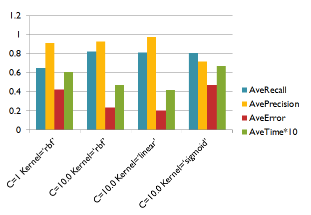
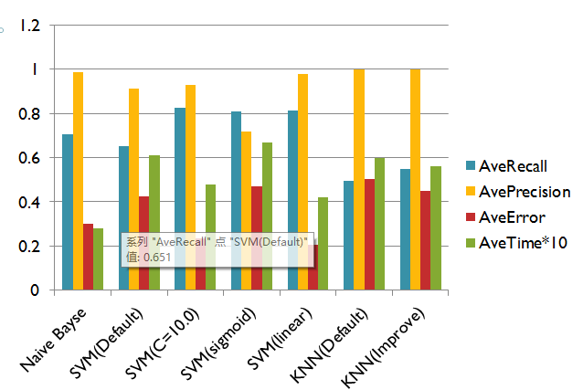
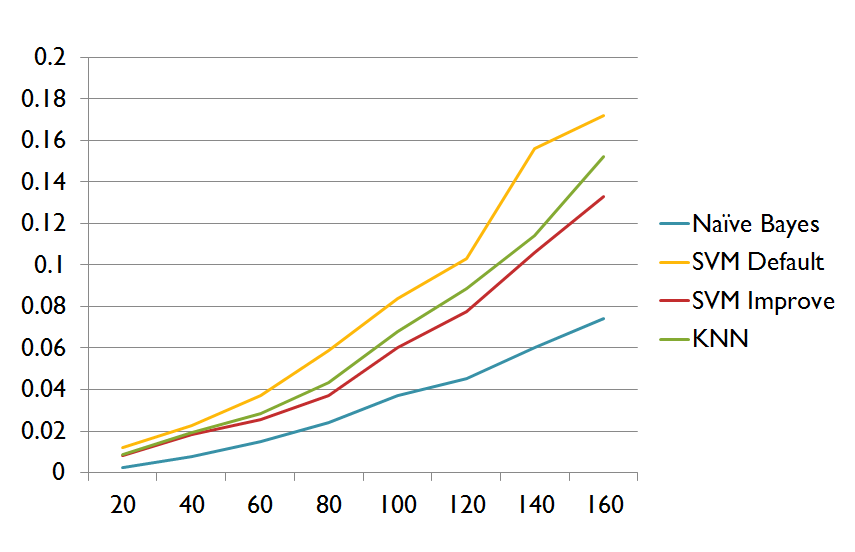

SpamSMSFiltering
=========

Data come from UCI machine learning repository.
[Download Data](https://archive.ics.uci.edu/ml/datasets/SMS+Spam+Collection)

Naive Bayes
===

Remarks
---

Use Laplacian  Smoothing to make sure probability not be zero.
Use Log() to calculate because probability maybe too small and computer can't figure out. 

Result
---

Base on 60 Training Data and 20 Testing Data, and run 10 times to get an average.

MaxRecall: 0.8

MaxPrecision: 1.0

MinError: 0.2

AveRecall: 0.7068421052631579

AvePrecision: 0.9854166666666666

AveError: 0.3

AveTime: 0.028286582971390355

SVM (Support Vector Machine)
===

Use Sklearn package.

default
---

####C=1 Kernel=‘rbf’

MaxRecall: 1.0

MaxPrecision: 1.0

MinError: 0.05

AveRecall: 0.6505847953216375

AvePrecision: 0.9140598290598291

AveError: 0.425

AveTime: 0.06084513318737096

####Increase C(Penalty parameter)=10.0

MaxRecall: 0.9444444444444444

MaxPrecision: 1.0

MinError: 0.1

AveRecall: 0.8248402869919899

AvePrecision: 0.9303405572755418

AveError: 0.23500000000000004

AveTime: 0.04786081637264809

####C=10.0 Kernel='linear'

MaxRecall: 0.9

MaxPrecision: 1.0

MinError: 0.1

AveRecall: 0.8122222222222222

AvePrecision: 0.977124183006536

AveError: 0.205

AveTime: 0.04208579490100922

####C=10.0 Kernel='sigmoid'

MaxRecall: 1.0

MaxPrecision: 1.0

MinError: 0.2

AveRecall: 0.8083333333333332

AvePrecision: 0.7186842105263158

AveError: 0.47000000000000003

AveTime: 0.0670302688873385

|               SVM Chart            |
|:----------------------------------:|
|      |

KNN
===
Use Sklearn package.

####Default n_neighbors=5

MaxRecall: 0.6

MaxPrecision: 1.0

MinError: 0.4

AveRecall: 0.495

AvePrecision: 1.0

AveError: 0.505

AveTime: 0.060209280330714585

####n_neighbors=3, algorithm='ball_tree'

MaxRecall: 0.65

MaxPrecision: 1.0

MinError: 0.35

AveRecall: 0.5499999999999999

AvePrecision: 1.0

AveError: 0.45000000000000007

AveTime: 0.05553739146649517

Conclusion
====

Based on 60 training data and 20 testing data, there’s a chart:

|        Conclusion Chart            |
|:----------------------------------:|
|   |

Update V2.0
===

Based on 120 training data and 40 testing data:

|               Data Chart           |
|:----------------------------------:|
|  |

Each algorithm with different data set and different trend.

|               Time Chart           |
|:----------------------------------:|
|  |
